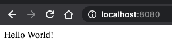

# HelloWorldCompare

Compare How many space need different programming languages in Docker Images. Application always the same. Hello World
over rest endpoint with a simple test.

## Ranking

### 1. Go

---

#### Docker Image Size => 320 MB (Traditional Docker Build)

- Runtime: golang:1.16-alpine => 301 MB
- Application: Go 1.16 => 19 MB

#### Docker Image Size => 10,0 MB (Multipart Docker Build Alpine)

- Runtime: alpine:3.13.5 => 5,6 MB
- Application: Go 1.16 => 4,4 MB

#### Docker Image Size => 4,42 MB (Multipart Docker Build Scratch)

- Runtime: scratch => 0,02 MB
- Application: Go 1.16 => 4,4 MB

### 2. Java (Plain)

---

#### Docker Image Size => 191 MB

- Runtime: adoptopenjdk/openjdk15:alpine-jre => 191MB
- Application: Java 15 => 3 KB

### 3. Java (Spring Boot)

---

#### Docker Image Size => 208 MB (Traditional Docker Build)

- Runtime: adoptopenjdk/openjdk15:alpine-jre => 191MB
- Application: Java 15 / Spring Boot 2.4.5 => 17 MB

#### Docker Image Size => 208 MB (Layered Docker Build)

- Runtime: adoptopenjdk/openjdk15:alpine-jre => 191 MB
- Application: Java 15 / Spring Boot 2.4.5 => 17 MB